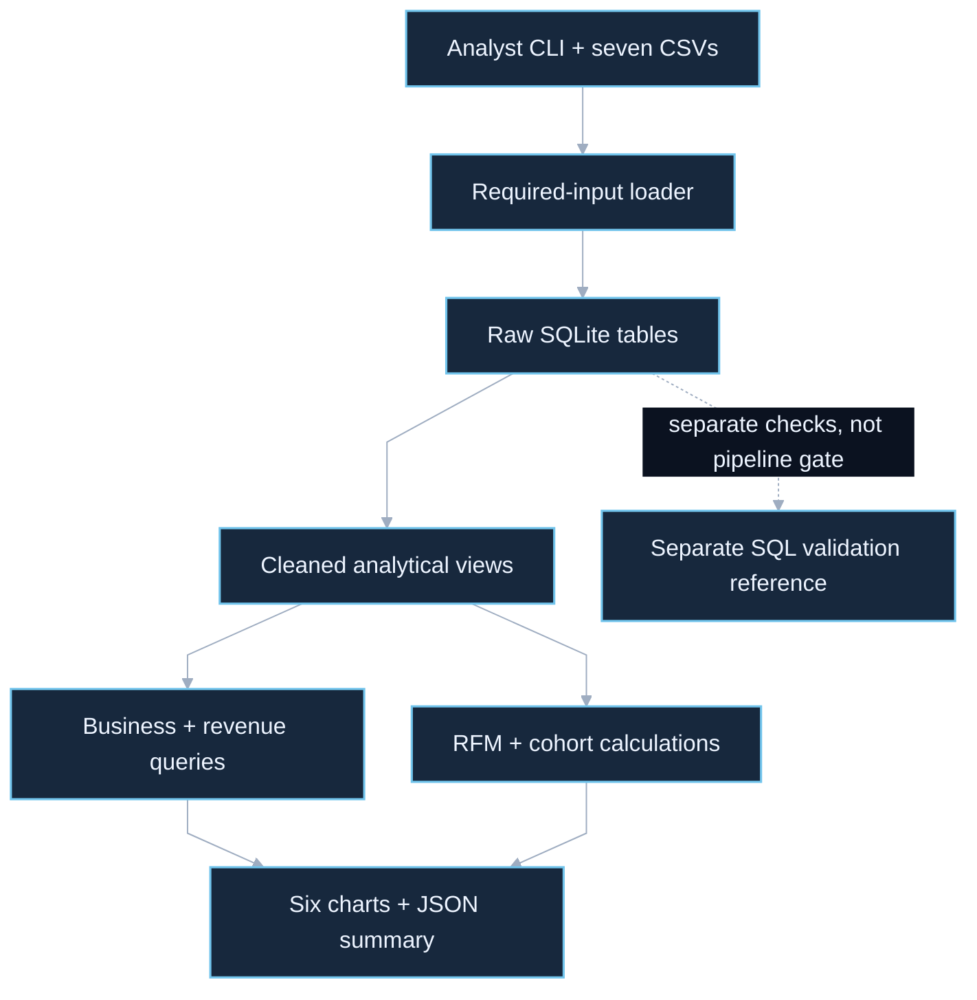

# Ecommerce Customer Analytics: architecture case study

Olist CSVs become reproducible SQLite views, customer segments and aggregate reporting artifacts.

Source snapshot: `3609c9a80a117dbf0ed00d27b075a9aad09e9550`. Reviewed on **2026-10-03**. This describes the selected committed source, excluding unrelated uncommitted work in the canonical checkout. It is not a runtime, provider, deployment or security certification.

## Overview

[Editable Mermaid](overview.mmd). Solid edges show the core flow; dashed edges show optional or separately invoked paths. Diagram connections summarize control/data flow rather than a complete import graph.

## Main flow

The analyst CLI loads seven required Olist extracts. The loader validates required inputs and identifiers, replaces raw SQLite tables, and creates indexes and cleaned delivered-order, payment-total and item/category views. Analysis queries calculate revenue, delivery, review quality, RFM and cohort retention. The output stage writes six charts and a deterministic JSON summary. SQL validation is available as a separate reference/checking path in this committed snapshot.

## Engineering decision

Centralize cleaning and aggregation in SQLite views. Summing payments once per order prevents join multiplication; separating raw tables from analytical views preserves the original extracts for validation. The resulting summaries are inspectable, but measure historical marketplace activity rather than causal business outcomes.

## Source map

| Component | Review path |
| --- | --- |
| Analyst CLI + seven CSVs | [analysis.py](../../analysis.py) |
| Required-input loader | [load_database.py](../../load_database.py) |
| Raw SQLite tables | [load_database.py](../../load_database.py) |
| Cleaned analytical views | [load_database.py](../../load_database.py) |
| Business + revenue queries | [analysis.py](../../analysis.py) |
| RFM + cohort calculations | [analysis.py](../../analysis.py) |
| Separate SQL validation reference | [sql/validation.sql](../../sql/validation.sql) |
| Six charts + JSON summary | [analysis.py](../../analysis.py) |

## Boundaries and limitations

- The selected committed run_pipeline loads then generates outputs; it does not execute SQL validation as an automatic pre-analysis policy gate. GitDiagram reflects a different remote revision for that edge.
- This commit uses rank(method="first") for quintile scoring, so ties may depend on input order. Canonical uncommitted corrections are intentionally excluded; this documentation does not fix or endorse that behavior.
- Raw extracts, SQLite databases and generated business outputs stay outside Git. No dataset run or business metrics were revalidated for this package.

## GitDiagram provenance

GitDiagram draft dated 2026-10-03 was inspected. Its automatic validation-policy gate is omitted from the reviewed committed-snapshot diagram; the separate SQL reference is shown with a dashed path.

[GitDiagram reference](https://gitdiagram.com/icecold009/ecommerce-customer-analytics) · [Repository](https://github.com/icecold009/ecommerce-customer-analytics)

The compact overview is a source-reviewed adaptation authored for this snapshot and rendered locally, not an unmodified GitDiagram export.

## Interview explanation

> I kept the raw Olist extracts separate from cleaned analysis views and aggregated payments before joining them to orders. That prevents inflated revenue from one-to-many joins. RFM and cohorts are descriptive outputs; tied scoring and validation must be checked at the exact code revision.

## Verification and refresh

Documentation-only acceptance: validate every relative source link and commit-specific diagram link, render Mermaid, inspect the dark PNG for readability, inspect the complete diff, and obtain a bounded Jev diff review. The repository proposal contains no new binary images; separately delivered PNG previews are independently checked because Jev reviews text. Results and Jev coverage are recorded in this task’s delivery report rather than treated as application test evidence.

After an architecture change, inspect the new source, update this snapshot identifier, regenerate the overview from Mermaid, and recheck links and image appearance. Keep planned integrations explicitly separate from implemented paths.

## Review status

Integration is pending warning resolution. Earlier Jev uncertainty has not been accepted or waived. The proposed repository changes are text only, including embedded Mermaid; PNG previews are separate delivery outputs. Source claims describe this committed snapshot. The coverage register accounts for tracked paths and does not prove every execution path or deployed behavior.

## Detailed coverage

See [the subsystem diagram and complete tracked-file register](coverage.md) and [editable detail Mermaid](detail.mmd). This supplement records recovery, optional services, delivery boundaries and original-checkout drift beyond the overview.

[Documentation verification record](verification.md).
