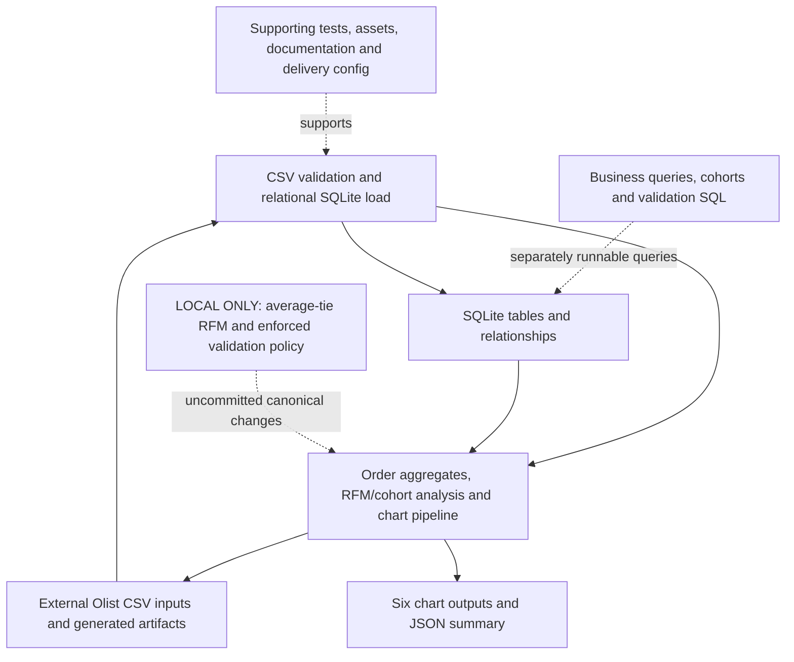

# Subsystem coverage register

Snapshot: `3609c9a80a117dbf0ed00d27b075a9aad09e9550`. The overview is intentionally compact; this detail layer accounts for the selected Git-tracked tree. Inventory coverage is not proof of every behavior, dynamic dependency, ignored file or deployed system. Nodes group modules rather than reproducing every function. Credentials, local datasets and generated dependencies are excluded.

## Flow and boundary notes

- The selected committed snapshot loads CSVs into SQLite and runs order/customer/product analytics, RFM, cohorts and chart/JSON outputs. SQL files are available for separate business/validation queries; do not infer the committed pipeline enforces the newer validation policy.
- The original checkout has pre-existing uncommitted changes: average-rank tie handling, an explicit validation policy with two warning checks, fatal/unknown-check handling and chart/accessibility improvements. They are represented by the dotted LOCAL ONLY node, excluded from this package, and not claimed as committed/released behavior.
- Data and outputs directories contain placeholders in Git; the diagram does not imply the dataset, generated charts or a successful dataset run are bundled or verified.

## Original checkout differences

Pre-existing changed paths at audit: `M README.md`, `M analysis.py`, `M load_database.py`, `M requirements-dev.txt`, `M tests/conftest.py`, `M tests/test_analysis.py`, `M tests/test_loading.py`, `?? .github/`. This documentation targets the commit above; these unrelated changes remain in the original checkout.

## File accounting

15 tracked paths, each assigned exactly once below. Supporting items remain explicit without becoming runtime services. Root dependency/build/CI files and otherwise unassigned support files are in DELIVERY; that bucket must be inspected for misclassified runtime modules.

### LOAD: CSV validation and relational SQLite load (1)

- `load_database.py`

### ANALYZE: Order aggregates, RFM/cohort analysis and chart pipeline (1)

- `analysis.py`

### SQL: Business queries, cohorts and validation SQL (3)

- `sql/business_queries.sql`
- `sql/cohort_retention.sql`
- `sql/validation.sql`

### DATA: External Olist CSV inputs and generated artifacts (2)

- `data/.gitkeep`
- `outputs/.gitkeep`
### TEST (3)

- `tests/conftest.py`
- `tests/test_analysis.py`
- `tests/test_loading.py`

### DOC (1)

- `README.md`

### ASSET (0)

None in this snapshot.

### DELIVERY (4)

- `.gitignore`
- `pyproject.toml`
- `requirements-dev.txt`
- `requirements.txt`
